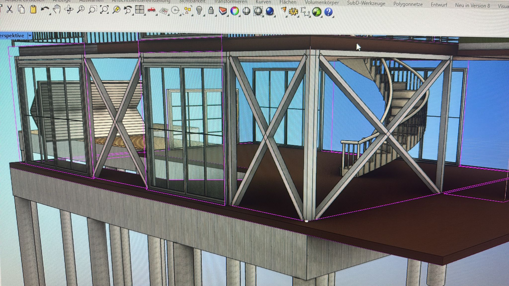

 

  
   
  <h1 align="center">Rhino3D - Bootshausprojekt</h1>

# Erste 3D-Modellierung mit Rhino3D
Bereits im ersten Semester bekammen wir erste Einblicke in das CAD-Tool "Rhino3D". Als Gruppe hatten wir die Wahl zwischen einem Bootshaus, einem Aussichtsturm und einem Baumhaus. Meine Gruppe entschied sich für ein Bootshaus, da wir uns der Herausforderung, am Wasser zu bauen, stellen wollten.

Vision & Vorbereitung

Unser Nutzungskonzept für das Boothaus war eine private Nutzung in Form eines Ferienhauses mit Aufbewahrung eines Motorbootes. Inbegriffen sind Wohnbereich, Bad, Küche, Technikraum, Zubehör, Benzin und Balkon sowie eine Steganbindung. 

Ersten Skizzen für das Bootshaus:

 

 

Prozess

Eine wichige Anforderung für das Projekt war der "Skelettbauweise". Skelettbauweise bedeutet, dass die tragende Konstruktion eines Gebäudes aus vertikalen Stützen und horizontalen Trägern besteht.

 

Da sich unser Boothaus größtenteils über dem Wasser befindet, haben wir unter das Haus und dem Steg Pfahlgründungen mit Stahlseilen aangebracht, um zusätliche Stabilisierung zu gewährleisten.

Neben den erforderten Plänen für verschiedene Ansichten sollten wir außerdem zwei Details modellieren. Wir haben eine Klampe für das Boot und eine Edelstahlschraube mit Öse für die Stahlseile konstruiert.

Ursprünglich haben wir das Bootshaus mit zwei Motorbooten geplant, weshalb man bei der Skizze des Boothauses von vorne zwei Öffnungen sieht. Dies haben wir zu einem Motorboot umgeändert, da der Platz für Technikraum sonst nicht mehr gerreicht hätte. Für mehr Privatsphäre und Schutz haben wir statt einer schlichten Öffnung ein Garagentor für das Boot eingebracht.

Ergebnisse

Zur endgültigen Abgabe haben wir A3 Pläne mit zwei Ansichten, eine Isometrie, eine Draufsicht und ein Schnitt erstellt.

2 Ansichten

 

Isometrie

 

Grundriss

 

Schnitt

Details

